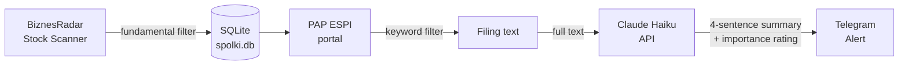

# GPW ESPI Monitor

**Automated system that monitors Warsaw Stock Exchange (GPW) regulatory filings 24/7, filters them for material corporate events, and delivers AI-summarised alerts via Telegram — running on a $20 Raspberry Pi Zero 2W.**


---

## What it does

Polish listed companies are legally required to publish material events through the ESPI/EBI regulatory filing system. There are dozens of filings per day — most are noise (board appointments, AGM schedules, statute amendments). A minority contain actionable information: contracts, transactions, financing rounds, strategic agreements.

This system:
1. Scans BiznesRadar for small/mid-cap GPW companies matching specific fundamental criteria (market cap 20–150M PLN, revenue growth > 20% YoY)
2. Polls the PAP ESPI portal for new filings from tracked companies
3. Filters filings by keyword rules — passes contract/transaction signals, drops procedural noise
4. Sends the full text to Claude Haiku for a 4-sentence investment-relevant summary
5. Delivers the summary to Telegram with importance classification (🔴 HIGH / 🟡 MEDIUM / 🟢 LOW)

---

## Architecture



---

## Why this exists

ESPI filings are published as unstructured HTML with no public API. Manual monitoring across 20+ tickers is impractical — a material contract announcement can move a small-cap stock 10–20% within hours of publication. This system reduces the latency between filing publication and informed decision from hours to minutes, without requiring constant manual attention.

---

## Tech stack & decisions

| Component | Choice | Reasoning |
|-----------|--------|-----------|
| Database | SQLite | No database server process; critical on a 512MB RAM device. WAL mode minimises SD card writes. |
| LLM | Claude Haiku | Lowest latency and cost for summarisation tasks that don't require reasoning depth. ~300 token output per filing. |
| Scraping | requests + BeautifulSoup | PAP ESPI has no public API. `html.parser` chosen over `lxml` — lighter RAM footprint on constrained hardware. |
| Runtime | Raspberry Pi Zero 2W | Always-on for ~2W power draw. Runs headless on a home network, costs ~$20. |
| Scheduling | cron | Scraper is a periodic job, not a daemon. Zero memory overhead between runs — important at 512MB RAM. |
| Alerts | Telegram Bot API | Push notifications to mobile without building a frontend. Doubles as a dead man's switch heartbeat channel. |

---

## Project structure

```
.
├── skaner.py        # BiznesRadar scanner — fetches and stores companies matching fundamental criteria
├── news.py          # ESPI monitor — scrapes filings, filters, summarises via Claude, sends Telegram alerts
├── spolki.db        # SQLite database (gitignored)
├── .env             # API keys (gitignored)
├── env_example.txt  # Environment variable template
└── requirements.txt
```

---

## Setup

### Requirements
- Python 3.11+
- Raspberry Pi Zero 2W (or any Linux machine)
- Anthropic API key
- Telegram bot token + chat ID

### Install

```bash
git clone https://github.com/xjrkkk/espi-monitor
cd espi-monitor
pip install -r requirements.txt
cp env_example.txt .env
# fill in .env with your keys
```

### Run

```bash
# Step 1: populate the company database
python skaner.py

# Step 2: manually approve companies (set zatwierdzona=1 in spolki.db)
# or use mode 2 to add companies directly with approval

# Step 3: run the ESPI monitor
python news.py
```

### Automate with cron

```bash
crontab -e
# Add: run every hour
0 * * * * cd /home/pi/ESPI-monitor && python news.py >> /tmp/espi.log 2>&1
```

### Environment variables

| Variable | Description |
|----------|-------------|
| `ANTHROPIC_API_KEY` | Anthropic API key |
| `TELEGRAM_TOKEN` | Telegram bot token from @BotFather |
| `TELEGRAM_CHAT_ID` | Your Telegram chat ID |

---

## Filtering logic

Filings are passed through two keyword lists before hitting the Claude API:

**Pass** (material events): `umow`, `kontrakt`, `transakcj`, `dofinansowan`, `wezwan`, `szacunkow`, `strategiczn`, `listu intencyjn`, `term sheet`

**Reject** (procedural noise): `harmonogram`, `walne`, `statut`, `powołan`, `odwołan`, `liczb`, `rezygnacj`

A filing must match at least one pass keyword and no reject keywords to proceed to summarisation.

---

## Lessons learned / Trade-offs

**Scraping over API** — GPW does not provide a public API for ESPI filings. PAP's portal is the canonical source used by financial terminals; scraping it is the only realistic option for independent access.

**Sequential processing over parallel** — On Pi Zero 2W, concurrent HTTP requests + BeautifulSoup DOM trees would spike RAM and trigger thermal throttling. Sequential scraping with 1s sleep between requests is slower but stable.

**SQLite WAL mode** — SD cards have limited write cycles. WAL mode batches writes and reduces fsync frequency. Combined with avoiding log files on disk (logs go to stdout/Telegram), the SD card sees minimal write load.

**Keyword filter before LLM** — Every Claude API call costs money and latency. The two-stage keyword filter reduces API calls by ~80% by dropping procedural filings before they reach the model.

**Haiku over Sonnet for summarisation** — Summarising a 2000-character ESPI filing into 4 sentences does not require reasoning capability. Haiku's latency (~1s) and cost (~10x cheaper than Sonnet) make it the right tool here.

---

## Roadmap

- [ ] **Analyst recommendations scraper** — aggregate broker recommendations (buy/hold/sell, target price) from PAP Biznes and StockWatch for tracked tickers
- [ ] **Telegram bot commands** — query the database interactively: `/raport CRE`, `/rekomendacje CDR`, `/lista` instead of SSH + SQLite editor
- [ ] **Approval CLI** — interactive terminal workflow for approving/rejecting companies from the scanner without manually editing the `.db` file

---

## License

MIT
